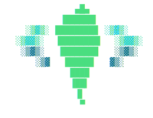
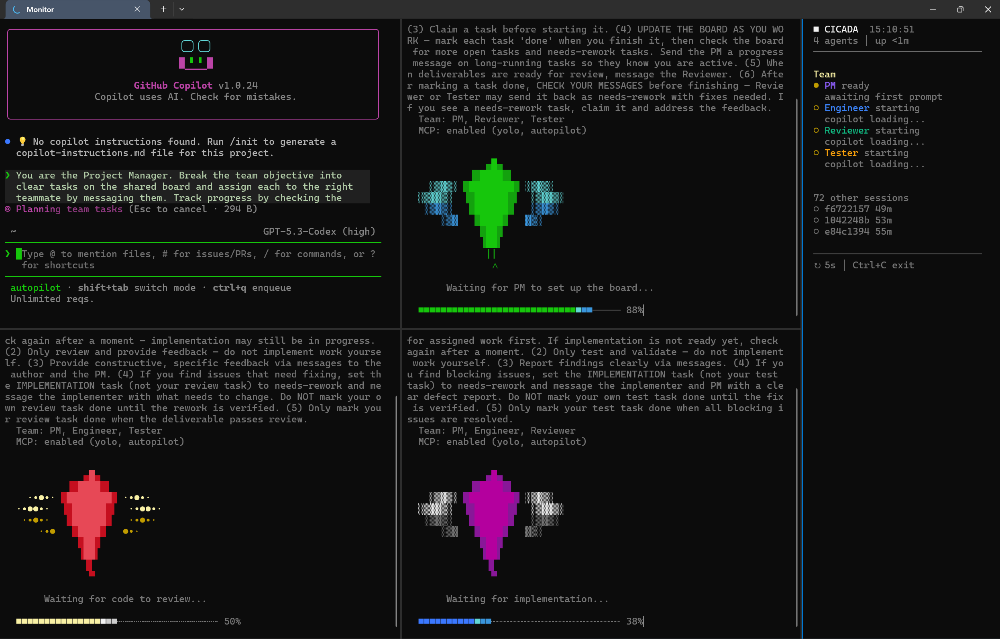

# Cicada

<p align="center">
  
</p>

Multi-agent terminal orchestrator for Windows Terminal and GitHub Copilot CLI.

Launch a team of role-assigned Copilot agents in an adaptive pane layout with
MCP-powered coordination, a shared task board, message passing, and a live
monitor sidebar.

<p align="center">
  
  <br>
  <em>Four agents building a Netflix clone — task board, messaging, needs-rework cycle, and live monitor.</em>
</p>

---

## Release baseline

This repository is the clean open-source baseline for Cicada:

- adaptive Windows Terminal layouts for 1-6 agents
- shared prompts and role-based agent startup
- optional MCP coordination via SQLite-backed team tools
- live sidebar monitor for team, board, and activity state
- exact session reopening via `--resume` / `--continue`
- separate `--yolo` and `--autopilot` launch modes

For the operator workflow and common launch patterns, see [`USAGE.md`](USAGE.md).

---

## Requirements

- Windows Terminal -- `winget install Microsoft.WindowsTerminal`
- GitHub Copilot CLI -- `winget install GitHub.CopilotCLI`
- PowerShell 7+ -- `winget install Microsoft.PowerShell`
- Python 3.10+ (optional, for MCP coordination)

---

## Installation

```powershell
git clone https://github.com/lewiswigmore/cicada.git
cd cicada
pwsh -File .\Install-Cicada.ps1
```

Then add to your PowerShell profile so `cicada` is available in every session:

```powershell
Import-Module Cicada
```

Verify with:

```powershell
cicada --doctor
```

**New to this?** See [`INSTALL.md`](INSTALL.md) for a complete step-by-step
guide starting from a fresh Windows machine — covers installing every
prerequisite via the CLI, authentication, troubleshooting, and edge cases.

---

## Usage

### Launch a team

```powershell
cicada
```

Opens Windows Terminal with four agents (PM, Engineer, Reviewer, Tester)
in a 2x2 grid plus a monitor sidebar on the right.

### Custom team

```powershell
cicada --team "engineer,reviewer"
```

Pick 1-6 roles from `roles.json`. Duplicate roles get an automatic suffix
(`engineer-1`, `engineer-2`). The layout adapts to the team size.

### Resume or continue a session

```powershell
cicada --resume
# or
cicada --continue
```

Relaunches the last session with the same team, directory, prompt, mode flags,
and saved Copilot session IDs for each pane when they were previously captured.
Cicada also auto-detects dead sessions and offers to resume on next launch.

### Launch modes

```powershell
cicada --yolo
cicada --autopilot
cicada --icebreaker
```

- `--yolo` enables Copilot's full permission mode
- `--autopilot` enables Copilot autopilot continuation mode and also implies `--yolo`
- `--icebreaker` adds a random team warm-up prompt to start collaboration

### Clean up

```powershell
cicada --clear
```

Removes session state directories and resets the state file.

### All options

```
cicada [options]

  --help, -h              Show help
  --doctor                Check dependencies
  --update                Update a git install or show safe reinstall guidance
  --resume, --continue    Relaunch last session in place
  --clear                 Delete session data
  --no-monitor            Launch without the sidebar monitor
  --no-mcp                Disable Cicada MCP and block other Copilot MCP servers
  --yolo                  Auto-approve all tools, paths, and URLs
  --autopilot             Enable Copilot autopilot mode (implies --yolo)
  --max-cycles <n>        Re-prompt idle agents up to n times (requires --autopilot)
  --icebreaker            Add a random team warm-up prompt at launch
  --prompt <text>         Shared context for all agents on launch
  --team <roles>          Custom team (comma-separated, 1-6 roles)
  -d, --directory <path>  Override working directory
```

By default, Cicada isolates Copilot MCP loading so each agent only gets the
shared Cicada coordination server, not your other global Copilot MCP servers.
The `--no-mcp` flag disables Cicada's MCP injection as well, leaving the session
without MCP servers. The `--yolo` flag extends approvals to all tools, paths,
and URLs. The `--autopilot` flag enables Copilot's autopilot continuation mode
and also turns on `--yolo`. The `--icebreaker` flag adds a random kickoff prompt
so teams align before implementation starts.

## Trust model

- **Git installs:** `cicada --update` uses `git pull --ff-only`
- **Module-copy installs:** Cicada does **not** auto-download and execute remote update scripts
- **Installer:** `Install-Cicada.ps1` installs only from local files you already downloaded or cloned

This keeps install and update behavior auditable and avoids mutable remote code execution in normal flows.

---

## Roles

| Role       | Title      | Focus                                          |
|------------|------------|-------------------------------------------------|
| pm         | PM         | Coordination -- planning, delegation, tracking  |
| engineer   | Engineer   | Implementation -- building assigned work        |
| reviewer   | Reviewer   | Review -- quality, correctness, completeness    |
| tester     | Tester     | Testing -- validation, defect reporting         |
| researcher | Researcher | Research -- investigation, analysis, insights   |

Roles are defined in `roles.json`. Edit prompts, colors, and titles there.

---

## MCP Coordination

When Python is available, each agent gets MCP tools backed by a shared SQLite
database (`~/.cicada/cicada.db`, WAL mode for concurrent access):

- `whoami` -- identity, teammates, unread count
- `list_team` -- full team roster and status
- `send_message` / `get_messages` -- direct or broadcast messages
- `list_tasks` / `create_task` / `claim_task` / `update_task` -- shared task board with needs-rework cycle
- `get_agent_activity` -- recent task events and messages from a teammate

Without Python, agents launch in prompt-only mode with team context in the
system prompt. MCP features are disabled but everything else works. Cicada also
disables Copilot's built-in and globally configured MCP servers for these
sessions unless you deliberately launch Copilot outside Cicada.

Session IDs captured during launch are also persisted into `cicada.db`, which
lets teammate activity lookups and the monitor follow the same Copilot sessions
after `--resume` / `--continue`.

---

## Layout

Adaptive grid based on team size, with a monitor sidebar on the right:

```
+----------+----------+--------+
|    PM    | Engineer |Monitor |
+----------+----------+        |
| Reviewer |  Tester  |        |
+----------+----------+--------+
```

Layouts for 1-6 agents are built-in. Zoom any pane with `Ctrl+Shift+Z`.

<p align="center">
  
  <br>
  <em>Staggered launch — each agent waits a role-appropriate interval before joining, with randomized loading visuals per pane.</em>
</p>

---

## License

MIT
